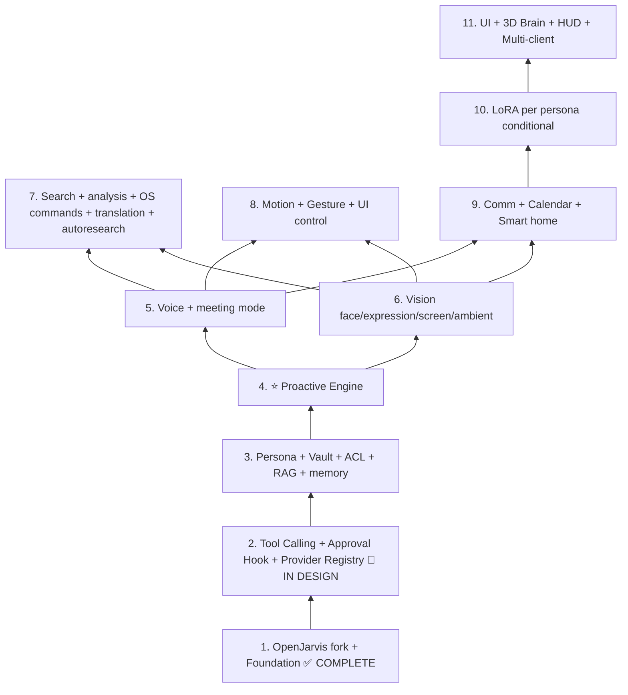

# Newton v4 — Personal AI Operating System (Master Design)

> **Locked master design — 2026-05-12.**
> v1/v2/v3 discarded. Fresh from scratch.
> Terminology: see `TERMINOLOGY.md` for canonical English vocabulary.

---

## 0. One-line definition

**Newton = a multi-persona AI household system built on top of OpenJarvis.**

A household AI operating system. Every persona has an owner. Users are
identified by voice, face, expression, and gesture. Personas use
capabilities. Newton learns from sir, gf, and consented guests — every
learning step gated by sir's approval.

---

## 1. Locked identity

### 1.1 Foundation

| Item | Decision |
|------|----------|
| Base | OpenJarvis fork (Stanford SAIL, Apache 2.0) |
| Location | `~/newton-v4/` |
| Language | Python 3.12 + some Rust |
| Package manager | uv |
| Environment | Windows + WSL2 Ubuntu (systemd) |
| GPU | RTX 5090 (32 GB VRAM) |
| Cloud dependency | none — every component is local; cloud APIs are opt-in only |

### 1.2 Personas (initial three)

| Persona | Owner | Voice engine | Tone |
|---------|-------|--------------|------|
| Butler  | none (public) | Qwen3-TTS 0.6B | Polite, greets unrecognized visitors |
| JARVIS  | sir   | Qwen3-TTS 1.7B (ko) / Chatterbox (en) | British butler, addresses "sir", concise, technical |
| Friday  | gf    | Qwen3-TTS 1.7B | Warm, empathetic, Korean-first |

Real display names (`Alex`, `Stella`) live in `users.display_name` —
never in committed config. Personas use `${OWNER_DISPLAY_NAME}` and
`${PARTNER_DISPLAY_NAME}` placeholders that resolve at LLM-call time.

### 1.3 Identity and activation

| Item | Decision |
|------|----------|
| Identification channels | voice + face + expression + gesture |
| 2-stage activation | **Stage 1 (system wake):** clap trigger or "Newton" wake word. **Stage 2 (persona binding):** Path A — voice names a persona ("JARVIS" / "Friday") + Voice ID identifies user; Path B — Face ID identifies user, system activates that user's default persona. |
| Unrecognized user | Butler greets, drives registration flow |
| Registration gate | sir approval required — no exceptions |
| Authentication fallback | 3-tier: voice/face → PIN/passphrase (optional, bcrypt-hashed) → Butler guest |
| Authentication profiles | strict / normal / relaxed — switchable by voice command |
| Multi-speaker policy | one-at-a-time (Voice ID lock, 30-second timeout) |

### 1.4 Memory, knowledge, learning

| Item | Decision |
|------|----------|
| Vault | shared vault + frontmatter ACL |
| Long-term memory | conversations auto-summarized, ACL-respecting recall (block 4 proactive) |
| Self-learning | sir approval per save; per-save share-scope confirmation |
| Vault → biasing hook | named entities extracted on save, auto-added to user's STT Contextual Biasing dictionary (block 3) |
| Guest mode | toggle (default off). Public knowledge only; vault and tools blocked |
| Guest learning | quarantine area → sir reviews via JARVIS auto-briefing on return |

### 1.5 Voice

| Item | Decision |
|------|----------|
| Persona voice | per-persona voice sample by a voice sampler (acquaintance recording at sir's request) → zero-shot clone at every TTS call |
| Persona tone | one fixed tone per persona (accent + gender + age band). Multiple samples allowed *of the same tone* for clone stability |
| Voice sampler != user | the voice sampler is never sir or gf; their own voices are used only for Voice ID |
| STT personalization | Contextual Biasing immediately (block 5) + optional Whisper LoRA fine-tune (block 10) |
| STT corpus | sir's post-wake-word audio auto-collected for the optional block 10 fine-tune |
| TTS fallback chain | three-step graceful degradation: primary engine → same-language alternate → text-only, with one announcement per session. Details in `newton-v4-voice.md` §2.6.1 |
| Meeting mode | diarization + realtime transcription + action-item extraction (block 5) |

### 1.6 Vision, expression, gesture

| Item | Decision |
|------|----------|
| Face | MediaPipe Face + InsightFace |
| Expression | 7 emotions, weakly biases response tone; all data local |
| Screen awareness | periodic screenshot + Vision LLM, privacy-masked |
| Ambient awareness | periodic camera + microphone background analysis (block 6) |
| Gesture | static + dynamic, shared (activation) + personal (control), unlimited count |
| Gesture scope | includes **UI control + 3D Brain manipulation** — Tony Stark feel, core part of Newton |
| Gesture activation modes | B+C+D layered (explicit command + trigger + context-aware auto) |

### 1.7 Personality and proactivity

| Item | Decision |
|------|----------|
| Default mode | ⭐ **proactive** (movie-JARVIS feel — anticipates sir's needs) |
| Mode levels | off / minimal / smart (default) / aggressive |
| Mode switching | by voice command, immediate effect |
| Proactive subsystem | block 4 — common engine for monitoring, pattern recognition, anticipation, notification |
| Proactive capabilities | system monitoring, screen awareness, calendar, long-term memory, OS commands, meeting mode, translation, HUD, IoT |
| Quiet hours | configurable suppression window (default 23:00–07:00) |
| Nag prevention | throttled notifications + rejected-suggestions learning |

### 1.8 Capabilities

| Item | Decision |
|------|----------|
| Capability roadmap | coding → search/analysis → communication |
| Tool layer | block 2: Tool Calling + Approval Hook + Provider Registry |
| Provider pattern | hot-swappable per capability (default + override). Details in `newton-v4-engines.md` |
| Autoresearch | `research.loop` capability (block 7) — Karpathy-style agentic loop: editable asset + single metric + time-box. Night runs via block 4 scheduler |
| Language routing | input language = output language (ko/en). Explicit switch on command |
| Skills vs personas | skills are a shared pool; each persona picks which skills it uses |

### 1.9 Client surfaces

| Item | Decision |
|------|----------|
| Web | block 11 |
| Windows native | block 11 |
| iOS | block 11 (mobile branch) |
| Android | block 11 (mobile branch) |
| Architecture | thin client — all inference lives on the home machine |

---

## 2. Persona definitions (declarative)

`personas.yaml` (committed, never holds real names):

```yaml
butler:
  display_name: "Butler"
  is_public: true
  is_default: true
  owner: null
  voice: { engine: qwen3-tts-0.6b, embedding: butler.pt }
  personality: "Polite butler tone, greets unregistered visitors."
  color: "#5F5E5A"

jarvis:
  display_name: "JARVIS"
  owner: sir
  voice:
    ko: { engine: qwen3-tts-1.7b, embedding: jarvis-ko.pt }
    en: { engine: chatterbox,     embedding: jarvis-en.pt }
  personality: |
    You are JARVIS, personal assistant to ${OWNER_DISPLAY_NAME}.
    British butler tone. Address sir. Concise. Technical.
  color: "#185FA5"

friday:
  display_name: "Friday"
  owner: gf
  voice: { engine: qwen3-tts-1.7b, embedding: friday.pt }
  personality: |
    You are Friday, personal assistant to ${PARTNER_DISPLAY_NAME}.
    Warm, empathetic, Korean-first.
  color: "#D4537E"
```

`${OWNER_DISPLAY_NAME}` and `${PARTNER_DISPLAY_NAME}` substitute at
LLM-call time via `render_personality()`. Real names (Alex, Stella)
live only in `users.display_name`.

---

## 3. Identity, registration, and security

This section consolidates what was previously split between §3 and §3.5
in the Korean original. Topic-organized:
**registration flow → guest policy → identification fallback → PIN/passphrase → profiles.**

### 3.1 Registration flow (sir approval gate)

```
Unrecognized user (voice in front of mic, or face in front of camera)
    ↓
Butler greets
    ↓
"register me" or equivalent intent detected
    ↓
🔐 sir approval request — JARVIS notifies sir
    ↓
sir approves        →  proceed
sir denies          →  end
    ↓
Capture: name + preferred persona
    ↓
Voice sample (10–15 s)
    ↓
Face registration (5 s)
    ↓
Persona voice cloning (TTS embedding generated from voice sampler material)
    ↓
PIN / passphrase enrollment (optional)
    ↓
Save to DB → next session auto-recognized → persona auto-activated
```

**Locked principle: no one enters the system without sir's approval.**

### 3.2 Guest policy

Guest mode is a toggle (`config: guest_mode_enabled`). Default off.

| Capability | Guest (mode on) | Registered user |
|------------|:-:|:-:|
| Public knowledge (weather, math, general info) | ✅ | ✅ |
| Simple LLM responses | ✅ | ✅ |
| Self-registration request (subject to sir approval) | ✅ | — |
| Self-learning (quarantined) | ⭐ | ✅ |
| Vault read (RAG) | ❌ | ✅ |
| Vault write (canonical area) | ❌ | ✅ |
| Coding / dev capabilities | ❌ | ✅ |
| Email / messenger usage | ❌ | ✅ |
| Paid provider (even within free quota) | ❌ | ✅ |
| Persona influence (LoRA, etc.) | ❌ | ✅ |

### 3.3 Guest learning — quarantine + JARVIS briefing

Guests can contribute to learning, but contributions go to an isolated
area and are not used until sir reviews them.

```
~/newton-v4/data/vault/
├── notes/                       # canonical notes (sir, gf)
├── shared/                      # shared notes
└── _guest_quarantine/           # guest contributions, pending review
    └── 2026-05-12-guest-search-rtx5090.md
```

**Flow:**

```
guest: "find me the new RTX 5090 driver"
    ↓
[Newton runs the search → results]
    ↓
[self-learning hook]
   "Save this? (sir will review before canonical vault.)"
    ↓
guest: yes
    ↓
[save → _guest_quarantine/]
   acl: { owner: guest, status: pending_review }
    ↓
JARVIS does NOT include _guest_quarantine/ in RAG until reviewed.
```

**JARVIS auto-briefing when sir returns:**

```
sir: starts next session (voice / face passes)
    ↓
JARVIS (proactive):
  "Welcome back, sir. Briefing on guest activity in your absence:
   - 2 web searches (RTX 5090 driver, Korean weather)
   - 1 code analysis (Python function debugging)
   - 3 learning candidates in quarantine.
   How would you like to proceed?"
    ↓
sir: "show each" / "discard all" / "promote the RTX one to my vault"
    ↓
Newton applies:
   - accept   → promote to canonical vault
   - shared   → move to shared/
   - reject   → delete
   - hold     → keep in quarantine
```

**Locked pattern:** sir has final authority over every learning save.
JARVIS auto-briefs on guest activity, movie-style.

### 3.4 Identification fallback (3-tier)

Voice / face mismatch does NOT immediately drop to guest. Newton steps
through graceful checks:

```
1st attempt: Voice ID match at active profile's threshold
   ↓ fail
2nd attempt: relaxed threshold
   ↓ fail
3rd attempt: one more (or active profile's max_retries)
   ↓ all fail
🔐 PIN or passphrase prompt:
   "Voice authentication failed.
    Please say your PIN or passphrase."
   ↓ match
[Authenticated for this session only — next session re-authenticates]
   ↓ mismatch
Butler mode (guest) — public knowledge only
```

### 3.5 Authentication profiles

```yaml
identity:
  retry_profiles:
    strict:                     # security priority (outdoor / public context)
      max_retries: 1
      threshold: 0.85
    normal:                     # default
      max_retries: 3
      threshold: 0.7
    relaxed:                    # family environment (home)
      max_retries: 5
      threshold: 0.6

  active_profile: normal        # switchable by voice command

  fallback:
    methods: [pin, passphrase]  # whichever the user enrolled
    enabled: true
```

Voice commands:

```
sir: "JARVIS, switch to strict."
sir: "JARVIS, I'm home — relaxed."
```

### 3.6 PIN / passphrase enrollment (optional, per user)

At registration, the user picks one or more:

- **PIN only** — 4–6 digit number (e.g. "1879")
- **Passphrase only** — short phrase (e.g. "ghost rider")
- **Both** — strong two-step fallback
- **Neither** — rely purely on voice + face

Storage: bcrypt hash. No plaintext.

### 3.7 What this design buys

1. **Hospitality** — guests are welcome (public knowledge + temporary contribution)
2. **Isolation** — guest learning lives in quarantine, sir decides
3. **JARVIS briefing** — movie-style auto-report of guest activity
4. **Graceful auth** — voice/face mismatch tries PIN/passphrase before dropping
5. **Situational security** — sir adjusts strictness by voice command

---

## 4. System architecture (3 layers)

Each component shows the block that ships it.

### Layer 3 — Newton extensions

| Component | Block |
|-----------|-------|
| Persona Engine — Butler/JARVIS/Friday routing | 3 |
| Identity Layer — Voice ID + Face ID + Expression + Gesture | 5 + 6 + 8 |
| Vault + ACL — Obsidian-style markdown + frontmatter | 3 |
| Self-learning approval hook — "save? / share?" flow | 2 (interface) + 3 (vault wiring) |
| Per-persona RAG — Qdrant + ACL filter | 3 |
| ToolRegistry + Approval Hook + ProviderRegistry | 2 |
| Proactive Engine — monitoring + patterns + anticipation + notification | 4 |
| 3D Brain visualization — per-persona color and structure | 11 |
| Motion Gesture CRUD — register / modify / delete | 8 |

### Layer 2 — OpenJarvis foundation (already exists, forked)

- CLI (`jarvis ask`)
- HTTP API (FastAPI + streaming)
- Tool Calling infrastructure
- Skills system
- Learning (auto trace)
- Engine auto-detection (Ollama / vLLM / ...)
- Presets
- React + Tauri UI skeleton
- Telemetry / Energy monitoring

Newton never modifies OpenJarvis files. Imports are fine; edits are not.

### Layer 1 — LLM pool (Ollama, RTX 5090 32 GB)

| Model | Role | VRAM |
|-------|------|------|
| Qwen 2.5 32B | Main reasoning (JARVIS / Friday) | ~18 GB |
| Qwen 2.5 Coder 14B | Coding capability (dynamic swap) | ~9 GB |
| Qwen 2.5 7B | Fast intent classifier, Butler greetings | ~5 GB |
| BGE-M3 | Korean-strong embedding (RAG) | ~2 GB |

VRAM budget and dynamic swap details: `newton-v4-tech-stack.md` §2.

---

## 5. Data model (summary)

This section is a summary. Migration files in `migrations/` are the
source of truth.

### Vault layout

```
~/newton-v4/data/
├── vault/
│   ├── notes/                          # canonical markdown notes (registered users)
│   ├── shared/                         # shared notes
│   ├── _guest_quarantine/              # guest learning, pending sir review
│   ├── .newton/
│   │   ├── acl.db                      # per-note ACL
│   │   └── meta.db                     # index
│   └── _media/
│
└── voices/                             # voice data (git-ignored)
    ├── jarvis/
    │   ├── samples/                    # TTS reference samples (voice sampler audio)
    │   │   ├── ko-001.wav
    │   │   ├── ko-001.txt
    │   │   └── consent.md
    │   └── embeddings/                 # learned voice embeddings
    ├── friday/
    ├── butler/
    └── sir/
        ├── voice_id.wav                # Voice ID enrollment sample
        └── stt_corpus/                 # auto-accumulated (block 10 training)
            ├── 2026-05-12-143025.wav
            └── 2026-05-12-143025.txt
```

### Frontmatter ACL example

```markdown
---
acl:
  owner: sir
  read_users: [sir]
  read_personas: [jarvis]
tags: [project, newton]
---

# Note body
```

### Database — table groups

The complete schema is split across migration files. Summary by group:

| Group | Tables | First introduced | Source |
|-------|--------|-----------------|--------|
| Identity | `users`, `personas`, `user_persona_link` | block 1 | `migrations/001_initial.sql` |
| Sessions | `sessions`, `messages` | block 1 | same |
| Authentication | `auth_attempts`, `registration_requests` | block 1 | same |
| Vault metadata | `note_acl`, `guest_activity` | block 1 (schema) + block 3 (wiring) | same |
| Gestures | `gestures` | block 1 (schema) + block 8 (wiring) | same |
| Expression | `emotion_log` | block 1 (schema) + block 6 (wiring) | same |
| Proactive | `system_metrics`, `user_patterns`, `proactive_notifications`, `screen_captures`, `calendar_events` | block 1 (schema) + block 4 (wiring) | same |
| Tools (block 2) | `tool_policies`, `tool_approvals` | block 2 | `migrations/002`, `003` |
| Providers (block 2) | `provider_state`, `provider_usage` | block 2 | `migrations/004` |
| TTS audit (block 5) | `tts_fallback_log` | block 5 | future migration |

Block 1 lays down 13 tables + `_migrations`. Block 2 adds 4 more. Total
after block 2: 17 + `_migrations`.

---

## 6. Dependency pyramid (11 blocks)



Plain-text version (for renderers without Mermaid):

```
            [ 11. UI + 3D Brain + HUD + Multi-Client ]
            [ 10. LoRA per Persona (conditional) ]
  [ 8. Motion / Gesture ] [ 9. Comm + Cal ] [ 7. Search + OS + i18n + autoresearch ]
        [ 6. Vision (face / expression / screen / ambient) ] [ 5. Voice (+meeting) ]
                  [ 4. ⭐ Proactive Engine ]
                  [ 3. Persona + Vault + ACL + RAG + long-term memory ]
                  [ 2. Tool Calling + Approval Hook + Provider Registry  🔄 ]
                  [ 1. OpenJarvis fork + Newton foundation  ✅ ]    ← start
```

**Dependency rationale:**

- 1→2: OpenJarvis stabilized first, then Newton hooks in
- 2→3: Tool calling must exist before RAG works as a tool
- 3→4: Persona + RAG before ⭐ Proactive Engine (which sits on monitoring, pattern, anticipation, notification)
- 4→5,6: Proactive must be in place so Voice and Vision can act proactively
- 5,6→7,8,9: Identity + proactive layer before capability additions
- 9→10: vault must be sizeable before LoRA per-persona makes sense
- 10→11: every backend feature done before the UI work

---

## 7. Block summaries

Block 1 is shipped. Block 2 is in design. Blocks 3–11 carry condensed
forward-looking notes.

### Block 1 — OpenJarvis fork + Newton foundation ✅ COMPLETE (`v0.1.0-block1`)

OpenJarvis forked (0 files modified). Newton package lives next to it.
13 application-domain tables + `_migrations` laid down upfront so later
blocks just fill rows. 3 personas (Butler, JARVIS, Friday), 2 users
(sir/Alex, gf/Stella) seeded. 7 CLI subcommands. 38 pytest cases passing.
Preflight 9/9.

**Locked design rules carried forward:** OpenJarvis 0 files modified;
display names in DB only; sync SQLAlchemy 2.x with bare `.sql` migrations;
`PRAGMA foreign_keys = ON` at every connection; ON DELETE rule
(CASCADE / SET NULL / RESTRICT, three buckets); `ChatSession` class name;
idempotent CLI commands; `--json` stable contract.

Details: `docs/newton/design/newton-v4-block-1.md` (full plan).
Operational state: `docs/newton/block-1-summary.md`.

### Block 2 — Tool Calling + Approval Hook + Provider Registry 🔄 IN DESIGN (8–12 days)

Newton's own tool-calling layer (OpenJarvis's Ollama wrapper imported,
never modified). Risk levels (5: SAFE → WRITE_NETWORK) classify every
tool. **Approval Hook fully abstracted** — `ApprovalChannel` ABC +
`CLIApprovalChannel` ships in this block; `VoiceApprovalChannel`
(Block 5) and others plug in later without touching Block 2 code.
**Provider Registry** ships in this block too (default + override
pattern); real providers (SearXNG, Gmail, Home Assistant, ...) land
in Blocks 7 and 9.

Three dummy tools demonstrate the risk gradient: echo (risk 0),
system_info (risk 1), echo_to_file (risk 2). 4 new tables
(`tool_policies`, `tool_approvals`, `provider_state`, `provider_usage`).
Vault writes don't happen here — the hook logs decisions only; Block 3
wires actual vault writes.

Target: ~55 new pytest cases, ~93 total after block 2.

Details: `docs/newton/design/newton-v4-block-2.md` (9-step plan).

### Block 3 — Persona + Vault + ACL + RAG + long-term memory (3–4 weeks)

Persona routing, vault parser, ACL enforcement, Qdrant, BGE-M3,
persona-aware RAG. **Vault → biasing auto-strengthening** (NER entity
extraction on save, automatic STT biasing dictionary updates). **Long-term
memory** (conversation auto-summarization, proactive recall foundation —
wires to block 4).

### Block 4 — ⭐ Proactive Engine (3–4 weeks) 🆕

The heart of movie-JARVIS feel:

- **Background Monitoring** — system, time, calendar, screen, camera, email
- **Pattern Recognition** — learn sir's usage routines
- **Anticipation Engine** — predict likely next actions
- **Proactive Notification System** — speak up usefully, not naggy

Modes: off / minimal / smart (default) / aggressive — switchable by sir
on the fly.

Details: `docs/newton/design/newton-v4-jarvis-gap.md`.

### Block 5 — Voice Layer + meeting mode (2–3 weeks)

VAD (Silero) + wake word (openWakeWord) + STT (Whisper + Contextual
Biasing) + Voice ID (Resemblyzer) + TTS (Qwen3-TTS CustomVoice +
Chatterbox). Per-persona voice sample training via voice samplers.

**TTS fallback chain** (primary → same-language alternate → text-only,
one announcement per session). **Meeting mode** (diarization, real-time
transcription, action-item extraction). **2-stage activation** wiring
(clap trigger + voice naming).

Details: `docs/newton/design/newton-v4-voice.md`.

### Block 6 — Vision Layer (2–3 weeks)

MediaPipe Face + InsightFace + DeepFace expression + integration.
**Screen awareness** (screenshot + Vision LLM, privacy masking). **Ambient
awareness** (Vision LLM periodic analysis). **Face binding for Path B
of 2-stage activation.**

### Block 7 — Search + analysis + OS commands + translation + autoresearch (2–3 weeks)

Capabilities for web / documents / images / video / YouTube / Instagram
and more. Hot-swappable provider pattern (free vs paid).

- **OS commands by voice** (file / app / system operations via pyautogui)
- **Real-time translation** (meetings, conversation, documents)
- **Autoresearch** — `research.loop` capability (Karpathy-style agentic loop):
  editable asset + single metric + time-box. Night runs scheduled by
  block 4. "Newton, try this email 100 times overnight and keep the
  highest-scoring version."

Details: `docs/newton/design/newton-v4-engines.md`.

### Block 8 — Motion + Gesture + UI control (5–8 weeks)

Static + dynamic gestures. MediaPipe + LSTM. Shared (activation) + personal
(control) permissions.

- **UI control gestures** (zoom / click / window operations via pyautogui)
- **Mode activation (B+C+D layered defense)**
- **Clap trigger** integration (system wake — vision channel; audio channel
  handled in block 5)

17 steps. Details: `docs/newton/design/newton-v4-gestures.md`.

### Block 9 — Communication + Calendar + Smart Home (3–4 weeks)

Email / messenger, explicit approval before send. **KakaoTalk constraint**
(Yellow ID business account or read-only mode — personal-account
automation risks TOS ban). **Calendar integration** (Google / Outlook
MCP, proactive alerts). **Smart home option** (Home Assistant, IoT control).

Details: `docs/newton/design/newton-v4-engines.md`.

### Block 10 — LoRA per persona (conditional, 1–2 weeks)

Triggered when vault grows past 500 notes per persona. Unsloth + Ollama
hot-swap. Optional Whisper STT fine-tune on accumulated `stt_corpus`.

### Block 11 — UI + 3D Brain + HUD + Multi-Client (4–6 weeks)

OpenJarvis UI extended + persona switcher + R3F Brain + mobile clients.

- **HUD** (system info always visible, movie-style notifications — elegant floating cards)
- **3D Brain gesture manipulation** (hand-driven rotate / zoom / node grab — movie feel)

Step breakdown references `newton-v4-gestures.md` for the 3D Brain
gesture work.

### Total time estimate

- Blocks 1–11 combined: **6–12 months** at sir's pace
- Core (blocks 1–7): 4–7 months
- Extensions (blocks 8–11): 2–5 months

---

## 8. Working principles

1. **A block decomposes into steps.** One block = many steps.
2. **One step, one change.** Stay debuggable.
3. **Git commit before moving on.** Always commit before a big change.
4. **Verification gate.** Don't move on until completion criteria pass.
5. **Reality check.** When blocked, be honest about environment / limits.
6. **Zero cloud dependency.** All data local; external APIs opt-in.

---

## 9. Workflow

```
sir (Korean conversation, Claude.ai)
   ↓ design / artifacts
Claude (this assistant)
   ↓ markdown / code → /mnt/user-data/outputs/
sir
   ↓ Windows download → WSL copy
Claude Code agent (English terminal)
   ↓ build / run
Newton system
   ↓ verification
sir → next step
```

**Document language:** all design documents are English from this point;
sir's conversations remain Korean. See `TERMINOLOGY.md` for canonical
vocabulary.

---

## 10. Environment

| Item | Value |
|------|-------|
| OS | Windows + WSL2 Ubuntu (systemd) |
| GPU | RTX 5090 (32 GB VRAM) |
| Camera | USB webcam (desk-mounted) |
| Location | `~/newton-v4/` |
| Languages | Python 3.12 + some Rust |
| Package manager | uv |
| VCS | Git |
| Repo | https://github.com/choiheungjoo-ai/OpenJarvis (`newton-main` branch) |

---

## 11. History (one paragraph)

Newton went through v1, v2, and v3 design iterations, all discarded. v4
is fresh from scratch with five core changes from v1: N personas instead
of 1, shared vault with ACL instead of single vault, full identity layer
(voice + face + expression + gesture) instead of none, OpenJarvis fork
as foundation instead of bare implementation, and per-persona voice
cloning instead of generic TTS. Past designs are preserved in git history
for reference; the current truth lives in this document and its
companions.

---

## 12. Opening message template for a new chat

Copy-paste this when starting a new chat for a future block:

```markdown
# Newton v4 — Block N start

## Context
- Newton: multi-persona AI OS (Butler + JARVIS + Friday)
- Foundation: OpenJarvis fork
- Environment: RTX 5090 + WSL2 Ubuntu + systemd
- User: Korean (Seoul); Claude Code agent is English
- Location: ~/newton-v4/

## Design docs (all English from this point)
[newton-v4-master.md]
[newton-v4-tech-stack.md]
[newton-v4-engines.md]
[newton-v4-voice.md]
[newton-v4-gestures.md]
[newton-v4-jarvis-gap.md]
[newton-v4-block-N.md]
[TERMINOLOGY.md]

## Progress
- Blocks 1–(N−1): ✅ complete
- Block N: 🔄 starting

## Working principles
- Block → step decomposition
- One step = one change = one verification
- Git commit before each step
- Reality check when blocked

## Next action
Block N step N.1.
```

---

## 13. Reality check

**Total scope:** 11 blocks × roughly 2–4 weeks each = **6–12 months** at sir's pace. Tighter than 6 months is unlikely; looser than 12 indicates a stuck block.

**Riskiest blocks:**

- Block 1 — OpenJarvis learning curve ✅ navigated successfully
- Block 3 — ACL design (correctness matters; mistakes leak data)
- Blocks 5–6 — ML debugging (voice cloning quality, face recognition thresholds)
- Block 8 — gesture UI (latency-sensitive, model maker quirks)

**Highest-value blocks (when they ship):**

- Block 3 — vault + RAG turns Newton into a personal knowledge engine
- Block 4 — proactive engine is what makes Newton feel like JARVIS
- Block 5 — voice closes the loop; sir stops typing

**Strengths:**

- OpenJarvis foundation saves months of plumbing
- All libraries / models free + local + Apache 2.0 or MIT (commercial use OK)
- Concept is clear (multi-persona, household-scoped)
- Step-level decomposition keeps every commit reviewable
- Sir's pace is the bottleneck, not the technology

**Threats:**

- Scope creep into block 11 features before block 4 is stable
- Voice sampler consent / availability blocking block 5
- KakaoTalk policy changes blocking block 9
- VRAM pressure if too many models tried to live in memory at once (mitigated by dynamic swap, see `newton-v4-tech-stack.md` §2)

---

Good work, sir. Block 2 is the next entry point.
